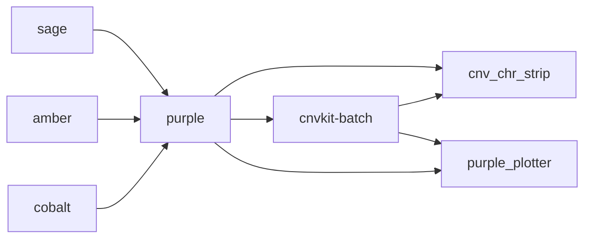

# eggd_atlas_cnv_workflow
Somatic CNV workflow for atlas pipeline

## Workflow Diagram

## What apps are used in this workflow?

|  App 	| Version  	|
|---	|---	|
|eggd_cgp-amber        |1.0.0|
|eggd_cgp-cobalt       |1.0.0|
|eggd_cgp-sage         |1.0.1|
|eggd_cgp-purple       |1.0.0|
|eggd_cgp-cnvkit-batch |2.0.2|
|eggd_cnv_chr_strip    |1.0.0|
|eggd_purple_plotter   |1.0.0|
 